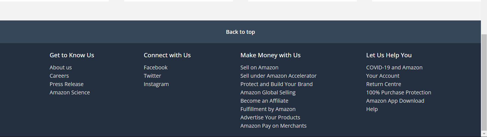

# Amazon UI Clone

This project is a clone of Amazon's UI, demonstrating various sections styled using CSS.
This project showcases a simple webpage layout with a header, banner, hero section, shop section, and footer. 
The HTML structure is organized using semantic tags, and the CSS provides styling and responsiveness to ensure a clean and user-friendly interface. 
The use of flexbox and grid layouts allows for flexible and responsive design.

## Hosted Link

The project is hosted on GitHub Pages. [Live Demo](https://elixirpoison.github.io/Amazon-UI-Clone/WT5Amazon)

## Screenshots and Explanations

### Header


- **HTML Tags Used:**
  - `<header>`: Defines the header section.
  - `<nav>`: Contains the navigation bar.
  - `<div>`: Used for various containers such as the logo, address, search bar, sign-in, returns, and cart.
  - `<a>`: Used for links.
  - ``: Displays the logo.
  - `<span>`: Contains icons.
  - `<input>`: Search input field.
  - `<select>`: Dropdown menu for search categories.

- **CSS Properties Applied:**
  - `header { width: 100%; background-color: #0f1111; }`
  - `.navbar { height: 60px; display: flex; align-items: center; justify-content: space-between; color: #fff; max-width: 1280px; margin: 0 auto; }`
  - `.nav-logo img { margin-top: 10px; width: 128px; }`
  - `.address .deliver { margin-left: 20px; font-size: 0.75rem; color: #ccc; }`
  - `.nav-search { display: flex; justify-content: space-evenly; max-width: 620px; width: 100%; height: 40px; border-radius: 4px; }`
  - `.select-search { background: #f3f3f3; width: 50px; text-align: center; border-top-left-radius: 4px; border-bottom-left-radius: 4px; border: none; }`
  - `.search-input { max-width: 600px; width: 100%; font-size: 1rem; border: none; outline: none; padding-left: 10px; }`
  - `.search-icon { max-width: 45px; width: 100%; display: flex; justify-content: center; align-items: center; font-size: 1.2rem; background: #febd68; color: #000; cursor: pointer; border-top-right-radius: 4px; border-bottom-right-radius: 4px; }`
  - `.cart { display: flex; }`
  - `.cart .cart-icon { font-size: 2.5rem; }`

### Banner


- **HTML Tags Used:**
  - `<div>`: Container for the banner and its content.
  - `<ul>`: Unordered list for navigation links.
  - `<li>`: List items.
  - `<a>`: Links to various sections.

- **CSS Properties Applied:**
  - `.banner { padding: 10px 20px; background: #222f3d; color: #fff; font-size: 0.875rem; }`
  - `.banner-content { margin: 0 auto; max-width: 1280px; display: flex; align-items: center; justify-content: space-between; }`
  - `.panel { max-width: 1280px; display: flex; align-items: center; gap: 5px; cursor: pointer; }`
  - `.links { display: flex; align-items: center; list-style: none; gap: 15px; flex-grow: 1; margin-left: 15px; }`
  - `.deals a { font-size: 0.9rem; font-weight: 500; white-space: nowrap; }`

### Hero Section


- **HTML Tags Used:**
  - `<section>`: Defines the hero section.

- **CSS Properties Applied:**
  - `.hero-section { height: 400px; background-image: url("https://priyanshu-240499.github.io/Assignments-CSS/Weekly%20Test%20for%20CSS%20(Week-3)/images/hero-img.jpg"); background-position: center; background-size: cover; }`

### Shop Section


- **HTML Tags Used:**
  - `<section>`: Defines the shop section.
  - `<div>`: Containers for shop items.
  - `<h3>`: Headings for shop categories.
  - ``: Images of shop items.
  - `<a>`: Links for shop items.

- **CSS Properties Applied:**
  - `.shop-section { display: flex; align-items: center; flex-direction: column; background-color: #f3f3f3; padding: 50px 0; }`
  - `.shop-images { display: grid; grid-template-columns: repeat(auto-fit, minmax(250px, 1fr)); gap: 40px; max-width: 1280px; width: 100%; overflow: hidden; }`
  - `.shop-link { background-color: #fff; padding: 30px; display: flex; cursor: pointer; flex-direction: column; white-space: nowrap; transform: scale(1); transition: transform 0.7s ease-in-out; }`
  - `.shop-link:hover { transform: scale(1.1); }`
  - `.shop-link img { width: 100%; height: 280px; object-fit: cover; margin-bottom: 10px; }`
  - `.shop-link h3 { margin-bottom: 10px; }`
  - `.shop-link a { display: inline-block; margin-top: 10px; font-size: 0.9rem; color: blue; font-weight: 500; transition: color 0.3s ease; }`
  - `.shop-link:hover a { color: #c7511f; text-decoration: underline; }`

### Footer



- **HTML Tags Used:**
  - `<footer>`: Defines the footer section.
  - `<div>`: Containers for footer items.
  - `<ul>`: Lists for footer links.
  - `<li>`: List items.
  - `<a>`: Links to various pages.

- **CSS Properties Applied:**
  - `.footer-title { display: flex; align-items: center; justify-content: center; background-color: #37475a; color: #fff; font-size: 0.875rem; font-weight: 600; height: 60px; }`
  - `.footer-items { display: flex; justify-content: space-evenly; width: 100%; margin: 0 auto; background: #232f3e; }`
  - `.footer-items h3 { font-size: 1rem; font-weight: 500; color: #fff; margin: 20px 0 10px 0; }`
  - `.footer-items ul { list-style: none; margin-bottom: 20px; }`
  - `.footer-items li a { color: #ddd; font-size: 0.875rem; }`
  - `.footer-items li a:hover { text-decoration: underline; }`


## HTML Structure

```html
<!DOCTYPE html>
<html lang="en">
<head>
  <meta charset="UTF-8">
  <meta name="viewport" content="width=device-width, initial-scale=1.0">
  <title>Amazon UI Clone</title>
  <link rel="stylesheet" href="styles.css">
</head>
<body>
  <<!DOCTYPE html>
<html lang="en">
<head>
  <meta charset="UTF-8">
  <meta name="viewport" content="width=device-width, initial-scale=1.0">
  <title>Geekster Project</title>
  <link rel="stylesheet" href="WT5Amazon.css">
  <link rel="stylesheet" href="https://fonts.googleapis.com/css2?family=Material+Symbols+Outlined:opsz,wght,FILL,GRAD@20..48,100..700,0..1,-50..200">
  </head>
  <body>
    <header>
      <nav class="navbar">
        <div class="nav-logo">
          <a href="#"></a>
        </div>
        <div class="address">
          <a href="#" class="deliver">Deliver</a>
          <div class="map-icon">
            <span class="material-symbols-outlined">location_on</span>
            <a href="#" class="location">India</a>
          </div>
        </div>

        <div class="nav-search">
          <select class="select-search">
            <option>All</option>
            <option>All Categories</option>
            <option>Amazon Devices</option>
          </select>
          <input type="text" placeholder="Search Amazon" class="search-input">
          <div class="search-icon">
            <span class="material-symbols-outlined">search</span>
          </div>
        </div>

        <div class="sign-in">
         <a href="#"> <p>Hello, sign in</p>
          <span>Account &amp; Lists</span></a>
        </div>

        <div class="returns">
          <a href="#"><p>Returns</p>
            <span>&amp; Orders</span></a>
        </div>

        <div class="cart">
          <a href="#">
            <span class="material-symbols-outlined cart-icon">shopping_cart</span>
            </a>
            <p>Cart</p>
        </div>
      </nav>
      
      <div class="banner">
        <div class="banner-content">
          <div class="panel">
            <span class="material-symbols-outlined">menu</span>
            <a href="#">All</a>
          </div>
  
          <ul class="links">
            <li><a href="#">Today's Deals</a></li>
            <li><a href="#">Customer Service</a></li>
            <li><a href="#">Registry</a></li>
            <li><a href="#">Gift Cards</a></li>
            <li><a href="#">Sell</a></li>
          </ul>
          <div class="deals">
            <a href="#">Shop deals in Electronics</a>
          </div>
        </div>
      </div>
    </header>

    <section class="hero-section"></section>

    <section class="shop-section">
      <div class="shop-images">
        <div class="shop-link" data-aos="flip-left" data-aos-duration='900'>
          <h3>Shop Laptops &amp; Tables</h3>
          
          <a href="#">Shop now</a>
        </div>
        <div class="shop-link" data-aos="flip-left" data-aos-duration='1000' >
          <h3>Shop Smartwatches</h3>
          
          <a href="#">Shop now</a>
        </div>
        <div class="shop-link" data-aos="flip-left" data-aos-duration='1100'>
          <h3>Create with Strip Lights</h3>
          
          <a href="#">Shop now</a>
        </div>
        <div class="shop-link" data-aos="flip-left" data-aos-duration='1200'>
          <h3>Home Refresh Ideas</h3>
          
          <a href="#">Shop now</a>
        </div>
      </div>
    </section>

    <footer>
      <a href="#" class="footer-title">
        Back to top
      </a>
      <div class="footer-items">
        <ul>
          <h3>Get to Know Us</h3>
          <li><a href="#">About us</a></li>
          <li><a href="#">Careers</a></li>
          <li><a href="#">Press Release</a></li>
          <li><a href="#">Amazon Science</a></li>
        </ul>
        <ul>
          <h3>Connect with Us</h3>
          <li><a href="#">Facebook</a></li>
          <li><a href="#">Twitter</a></li>
          <li><a href="#">Instagram</a></li>
        </ul>
        <ul>
          <h3>Make Money with Us</h3>
          <li><a href="#">Sell on Amazon</a></li>
          <li><a href="#">Sell under Amazon Accelerator</a></li>
          <li><a href="#">Protect and Build Your Brand</a></li>
          <li><a href="#">Amazon Global Selling</a></li>
          <li><a href="#">Become an Affiliate</a></li>
          <li><a href="#">Fulfillment by Amazon</a></li>
          <li><a href="#">Advertise Your Products</a></li>
          <li><a href="#">Amazon Pay on Merchants</a></li>
        </ul>
        <ul>
          <h3>Let Us Help You</h3>
          <li><a href="#">COVID-19 and Amazon</a></li>
          <li><a href="#">Your Account</a></li>
          <li><a href="#">Return Centre</a></li>
          <li><a href="#">100% Purchase Protection</a></li>
          <li><a href="#">Amazon App Download</a></li>
          <li><a href="#">Help</a></li>
        </ul>
      </div>
    </footer>
  </body>
</body>
</html>>
</body>
</html>
